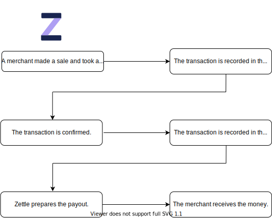

How card payments work at Zettle
===
A merchant's Zettle account handles different status of transactions. As shown in [Figure 1 Zettle card transaction flow](#Zettle-card-transaction-flow), after a merchant takes a card payment with Zettle, the transaction for the payment will go through the following phases in sequence:
1. Recorded in the merchant's Zettle preliminary account:
 
   Zettle checks the transaction with the acquiring bank to capture the funds.
   
2. Recorded in the merchant's Zettle liquid account:

   Zettle checks whether the payment is ready to be paid out to the merchant.
   
3. Recorded as payout in the merchant's Zettle liquid account: 
  
   Zettle makes sure that the correct amount of money will be paid out from the merchant's Zettle account to the merchant's bank account or PayPal Wallet for PayPal users. Then the merchant will receive the payment in the upcoming payout.
   
> **Note:** It usually takes two business days for the payment to be paid out. However, it may take longer.

<figure >  <figcaption><b>Figure 1. </b>Zettle card transaction flow</figcaption></figure>

