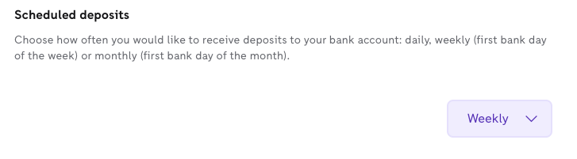

Fetch payout information
===
Using the Finance API, you can fetch payout information from a merchant's Zettle account. By default, it's fetched from the merchant's Zettle liquid account. The payout information includes the account balance, currency, payout, periodicity, and so on. 

<!-- Is there any limit for how oldest transactions can be fetched? -->  

* [Prerequisites](#prerequisites)
* [Step 1: Fetch payout information](#step-1-fetch-payout-information)
* [Related task](#related-task)
* [Related API reference](#related-api-reference)

## Prerequisites
* Make sure that authorization is set up using [Authorization OAuth2 API](../../authorization.adoc). 
<!-- to be continued if any -->

## Step 1: Fetch payout information
You can fetch payout information from a merchant's Zettle account for any given day.

1. Optional: Fetch your organisation UUID. 
   > **Tip:** You don't need to fetch the organisation UUID, as you can specify the organisation UUID as `self` in requests that require it.

    ```
    GET users/me
    ```
   Example:
       
   The following example response returns organisation UUID `ab305d54-75b4-431b-adb2-eb6b9e546013`.

    ```
    {
        "uuid": "de305d54-75b4-431b-adb2-eb6b9e546014",
        "organizationUuid": "ab305d54-75b4-431b-adb2-eb6b9e546013"
    }
    ```

2. Fetch payout information on a specific day. If you don't specify `at`, you will get the latest payout information by default.
      > **Tip:** You specify the organisation UUID as `self`.
     
   ```
   GET /organizations/{organizationUuid}/accounts/liquid/payout-info?{at}
   ```

   Example:
   
   The following example request fetches the payout information for 7 June, 2021.
   
   ```
   GET /organizations/self/payout-info?at=2021-06-07
   ```
       
   The following example response returns the payout information for 7 June, 2021.

    ```json
    {
        "data": {
            "totalBalance": 9022,
            "currencyId": "SEK",
            "nextPayoutAmount": 0,
            "discountRemaining": 10000,
            "periodicity": "WEEKLY"
        }
    }
    ```
   > **Tip**: The periodicity can be changed to `daily` or `monthly` in the merchant's Zettle Back Office > **Account & settings** > **Scheduled deposits**.                                                                                   
           

## Related task
* [Fetch account balance](fetch-account-balance.md)
* [Fetch account transactions](fetch-account-transactions.md)

## Related API reference
* [Finance API reference](../api-reference.md)